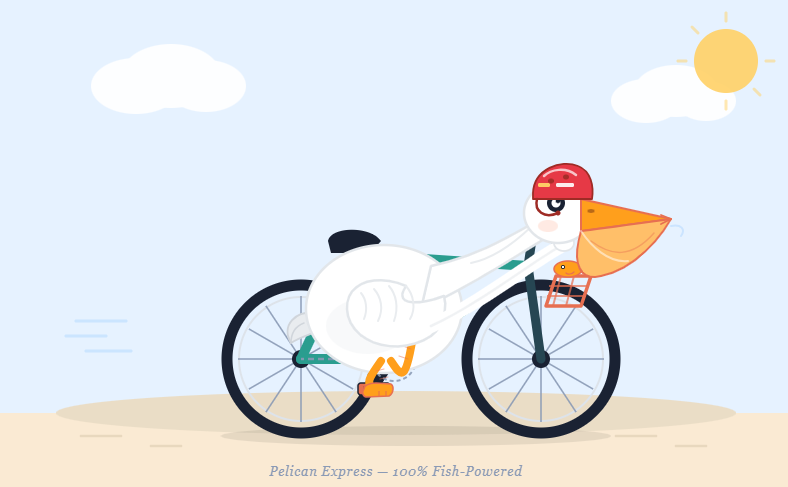

# Pelican Bicycle Benchmark

English | [简体中文](readme_zh.md)

A benchmark testing the SVG generation capabilities of major large language models.

## Methodology

- All models received the **exact same** prompt: `generate an svg of a pelican riding a bicycle`
- Outputs are stored under `vendor/model/` directories

## Results Overview

8 vendors, 13 models in total. Vendors are ordered by the release date of their earliest model; models within each vendor are listed chronologically.

| Vendor | Model | Release Date | Thinking Effort | Output File |
|---|---|---|---|---|
| Anthropic | Claude Opus 4.7 | 2026-04-16 | max | `claude/claude-opus-4.7/opus-4.7-max.png` |
| Anthropic | Claude Opus 4.8 | 2026-05-28 | max | `claude/claude-opus-4.8/opus-4.8-max.jpg` |
| Anthropic | Claude Fable 5 | 2026-06-09 | max | `claude/claude-fable-5/fable-5-max.jpg` |
| Anthropic | Claude Sonnet 5 | 2026-06-30 | max | `claude/claude-sonnet-5/sonnet-5-max.png` |
| OpenAI | GPT-5.5 | 2026-04-23 | xhigh | `GPT/gpt-5.5/gpt-5.5-pelican-xhigh.png` |
| OpenAI | GPT-5.6 Luna | 2026-07-09 | high / xhigh / max | `GPT/gpt-5.6-luna/` |
| OpenAI | GPT-5.6 Sol | 2026-07-09 | high / xhigh / max | `GPT/gpt-5.6-sol/` |
| OpenAI | GPT-5.6 Terra | 2026-07-09 | high / xhigh / max | `GPT/gpt-5.6-terra/` |
| DeepSeek | DeepSeek V4 Flash | 2026-07-31 | max | `DeepSeek/deepseek-v4-flash/v4-flash.png` |
| DeepSeek | DeepSeek V4 Pro | 2026-08-13 | max | `DeepSeek/deepseek-v4-pro/v4-pro.png` |
| Xiaomi | MiMo v2.5 Pro | 2026-04-27 | max | `xiaomi/mimo-v2.5-pro/mimo-v2.5-pro.png` |
| Z.ai | GLM-5.2 | 2026-06-16 | max | `GLM/glm-5.2/glm-5.2-max.jpg` |
| Z.ai | GLM-5.3 | 2026-08-14 | max | `GLM/glm-5.3/glm-5.3-max.png` |
| Moonshot AI | Kimi K3 | 2026-07-16 | max | `Kimi/kimi-k3/kimi-3-pelican.jpg` |
| Alibaba | Qwen 3.8 Max | 2026-08-03 | max | `Qwen/Qwen-3.8-Max/qwen-3.8-max-pelican.png` |
| Alibaba | Qwen 3.8 27B | 2026-08-14 | max | `Qwen/Qwen-3.8-27B/qwen-thinking-bicycle-27b.jpg` |
| Meta | Muse Spark 1.2 | 2026-08-05 | max | `meta/muse-spark-1.2/muse-spark-1.2.png` |

## Model Outputs

### Anthropic

| | |
|---|---|
| **Claude Opus 4.7** 2026-04-16  | **Claude Opus 4.8** 2026-05-28  |
| **Claude Fable 5** 2026-06-09  | **Claude Sonnet 5** 2026-06-30  |

### OpenAI

**GPT-5.5** (2026-04-23, xhigh)

**GPT-5.6** (2026-07-09)

| | high | xhigh | max |
|---|---|---|---|
| **Luna** |  |  |  |
| **Sol** |  |  |  |
| **Terra** |  |  |  |

### DeepSeek

| | |
|---|---|
| **DeepSeek V4 Flash** 2026-07-31  | **DeepSeek V4 Pro** 2026-08-13  |

### Xiaomi

**MiMo v2.5 Pro** (2026-04-27)

### Z.ai

| | |
|---|---|
| **GLM-5.2** 2026-06-16  | **GLM-5.3** 2026-08-14  |

### Moonshot AI

**Kimi K3** (2026-07-16)

### Alibaba

| | |
|---|---|
| **Qwen 3.8 Max** 2026-08-03  | **Qwen 3.8 27B** 2026-08-14  |

### Meta

**Muse Spark 1.2** (2026-08-05)

