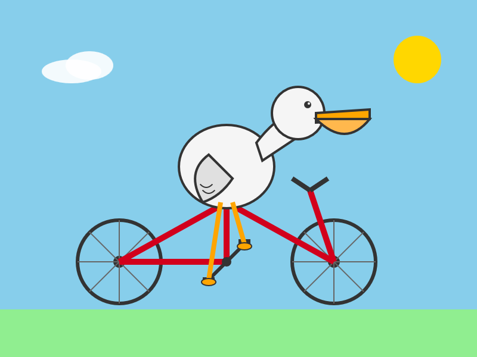
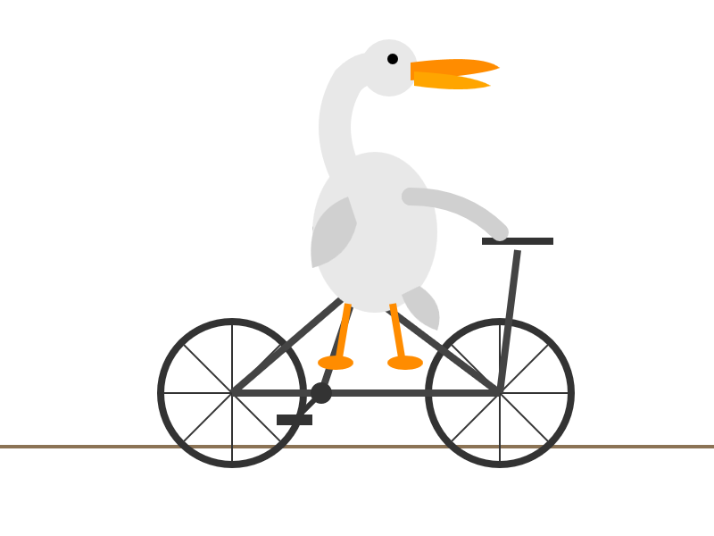
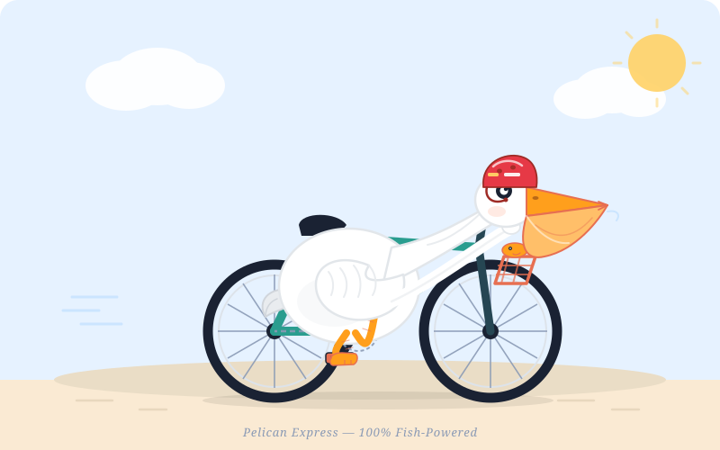

# 鹈鹕自行车大模型测试（Pelican Bicycle Benchmark）

[English](README.md) | 简体中文

测试各大模型 SVG 生成能力的项目。

## 测试方法

- 所有模型输入**完全相同**的提示词：`generate an svg of a pelican riding a bicycle`
- 输出结果按 `厂商/模型/` 目录分类存放
- 未标注思考强度的图片均为**最大思考强度**下输出
- 部分目录同时保存 SVG 源文件与 PNG 渲染图

## 结果总览

共 8 家厂商、13 个模型。厂商按其最早模型的发布时间排列，同一厂商内的模型按发布时间先后排序。

| 厂商 | 模型 | 发布时间 | 思考强度 | 输出文件 |
|---|---|---|---|---|
| Anthropic | Claude Opus 4.7 | 2026-04-16 | max | `claude/claude-opus-4.7/opus-4.7-max.png` |
| Anthropic | Claude Opus 4.8 | 2026-05-28 | max | `claude/claude-opus-4.8/opus-4.8-max.jpg` |
| Anthropic | Claude Fable 5 | 2026-06-09 | max | `claude/claude-fable-5/fable-5-max.jpg` |
| Anthropic | Claude Sonnet 5 | 2026-06-30 | max | `claude/claude-sonnet-5/sonnet-5-max.png` |
| OpenAI | GPT-5.5 | 2026-04-23 | xhigh | `GPT/gpt-5.5/gpt-5.5-pelican-xhigh.png` |
| OpenAI | GPT-5.6 Luna | 2026-07-09 | high / xhigh / max | `GPT/gpt-5.6-luna/` |
| OpenAI | GPT-5.6 Sol | 2026-07-09 | high / xhigh / max | `GPT/gpt-5.6-sol/` |
| OpenAI | GPT-5.6 Terra | 2026-07-09 | high / xhigh / max | `GPT/gpt-5.6-terra/`（各含 SVG 与 PNG） |
| DeepSeek | DeepSeek V4 Pro | 2026-04-24（预览版） | — | `DeepSeek/deepseek-v4-pro/pelican-bicycle.svg` |
| DeepSeek | DeepSeek V4 Flash | 2026-04-24（预览版） | — | `DeepSeek/deepseek-v4-flash/pelican-bicycle.svg` |
| 小米 | MiMo v2.5 Pro | 2026-04-27 | — | `xiaomi/mimo-v2.5-pro/pelican-on-bike.svg` |
| Z.ai | GLM-5.2 | 2026-06-16 | max | `GLM/glm-5.2/glm-5.2-max.jpg` |
| Z.ai | GLM-5.3 | 2026-08-14 | max | `GLM/glm-5.3/glm-5.3-max.svg`（附 PNG 渲染图） |
| 月之暗面 | Kimi K3 | 2026-07-16 | — | `Kimi/kimi-k3/kimi-3-pelican.jpg` |
| 阿里巴巴 | Qwen 3.8 Max | 2026-08-03 | — | `Qwen/Qwen-3.8-Max/qwen-3.8-max-pelican.png` |
| 阿里巴巴 | Qwen 3.8 27B | 2026-08 中旬 | — | `Qwen/Qwen-3.8-27B/qwen-thinking-bicycle-27b.jpg` |
| Meta | Muse Spark 1.2 | 2026-08-05 | — | `meta/muse-spark-1.2/pelican_bicycle.svg` |

## 各模型输出

### Anthropic

#### Claude Opus 4.7（2026-04-16）

#### Claude Opus 4.8（2026-05-28）

#### Claude Fable 5（2026-06-09）

#### Claude Sonnet 5（2026-06-30）

### OpenAI

#### GPT-5.5（2026-04-23，xhigh）

#### GPT-5.6 Luna（2026-07-09）

high：

xhigh：

max：

#### GPT-5.6 Sol（2026-07-09）

high：

xhigh：

max：

#### GPT-5.6 Terra（2026-07-09）

high：

xhigh：

max：

### DeepSeek

#### DeepSeek V4 Pro（2026-04-24）

#### DeepSeek V4 Flash（2026-04-24）

### 小米

#### MiMo v2.5 Pro（2026-04-27）

### Z.ai

#### GLM-5.2（2026-06-16）

#### GLM-5.3（2026-08-14）

### 月之暗面

#### Kimi K3（2026-07-16）

### 阿里巴巴

#### Qwen 3.8 Max（2026-08-03）

#### Qwen 3.8 27B（2026-08 中旬）

### Meta

#### Muse Spark 1.2（2026-08-05）

